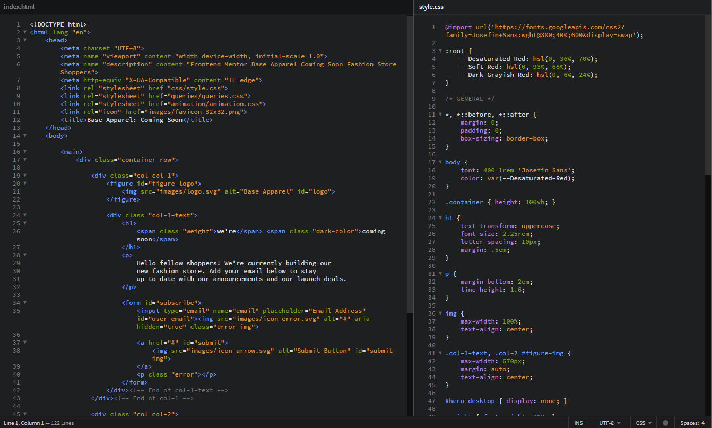
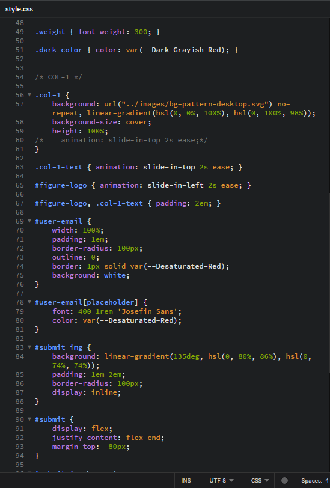
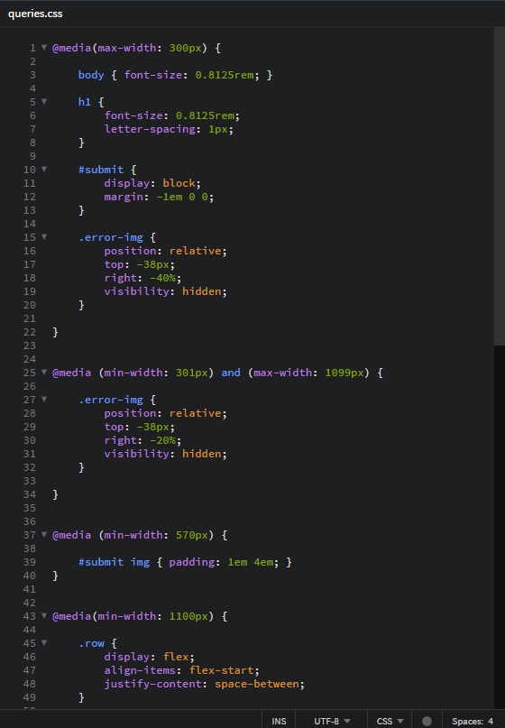
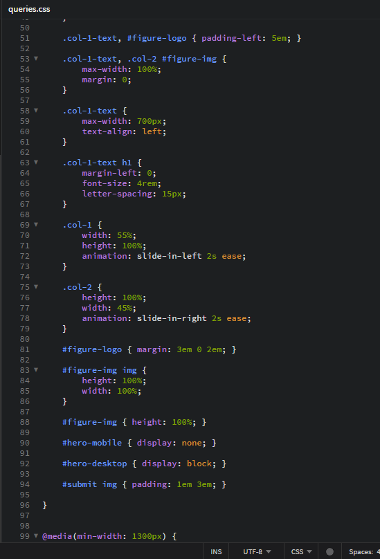
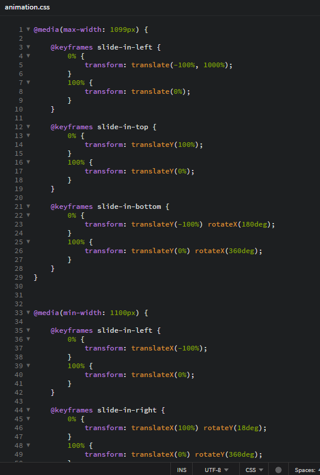

# Frontend Mentor - Base Apparel coming soon page solution

This is a solution to the [Base Apparel coming soon page challenge on Frontend Mentor](https://www.frontendmentor.io/challenges/base-apparel-coming-soon-page-5d46b47f8db8a7063f9331a0). Frontend Mentor challenges help you improve your coding skills by building realistic projects. 

## Table of contents

- [Overview](#overview)
  - [The challenge](#the-challenge)
  - [Screenshot](#screenshot)
  - [Links](#links)
- [My process](#my-process)
  - [Built with](#built-with)
  - [What I learned](#what-i-learned)
  - [Continued development](#continued-development)
  - [Useful resources](#useful-resources)
- [Author](#author)
- [Acknowledgments](#acknowledgments)

## Overview

### The challenge

Users should be able to:

- View the optimal layout for the site depending on their device's screen size
- See hover states for all interactive elements on the page
- Receive an error message when the `form` is submitted if:
  - The `input` field is empty
  - The email address is not formatted correctly

### Screenshot

### Links

- Solution URL: [My Solution on Frontend Mentor](https://www.frontendmentor.io/solutions/base-apparel-coming-soon-rWyMNUiP3n)

- Live Site URL: [Base Apparel: Coming Soon](https://tzienom.github.io/Base-Apparel-Coming-Soon/)

## My process

### Built with

- Semantic HTML5 markup
- CSS custom properties
- Mobile-first workflow
- JavaScript

### What I learned

At the cause of building this project, I did learn a few things like turning an anchor tag (<a>) into a button that submits a form, I was able to use JavaScript to switch layout positions of two elements. I did learn CSS animations, and had it implemented on this project, and quite a few others, too. In all, I loved building this.

### Continued development

- DOM Manipulation
- CSS animation

### Useful resources

- [https://www.geeksforgeeks.org/how-to-use-anchor-tag-as-submit-button/](https://www.geeksforgeeks.org/how-to-use-anchor-tag-as-submit-button/) - This helped me learn how to make an anchor tag submit a form.
- [https://www.geeksforgeeks.org/css-animations/?ref=lbp](https://www.geeksforgeeks.org/css-animations/?ref=lbp) - This was where I learnt CSS transform methods, and CSS animations, too.

## Author

- Frontend Mentor - [@Tzienom](https://www.frontendmentor.io/profile/Tzienom)